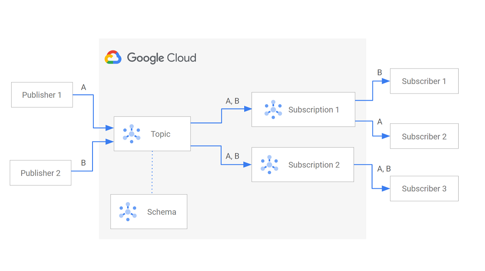

# GCP's Pub/Sub

## What is it
- A scalable, reliable, and fully managed messaging service messaging service provided by GCP (Google Cloud Platform).
- Used for asynchronous communication between services/applications.
- Can be used to build event-driven systems, data pipelines, real-time analytics, etc.

## How does it work
- Message delivery modes:
    - Push delivery:
        - Messages are pushed to the subscribers' endpoints (HTTP endpoints, cloud functions, etc).
        - Push delivery is ideal for real-time processing of messages.
    - Pull delivery:
        - Subscribers pull messages from Pub/Sub at their own pace.
        - Subscribers can periodically poll Pub/Sub for new messages.
        - Pull delivery is suitable for batch processing and handling variable processing loads.
- The communication is composed of:
    - Publishers:
        - Apps/services that generate and send messages into a pub/sub **topic**.
        - They send messages to specific topics they create or have access to.
    - Topics:
        - Named channels into which messages are published by publishers.
        - Each message is distributed to all subscribers of that topic.
        - Pub/Sub handles the routing, scaling, and load balancing of messages, ensuring that subscribers receive messages efficiently and reliably.
    - Subscribers:
        - Apps/services that receive messages from the topic they're subscribed to.
        - They can subscribe to one or more topics.
        - These messages are received in near real-time.
        - Acknowledgment:
            - Subscribers are responsible for acknowledging the messages they receive.
            - Once a message is acknowledged by a subscriber, Pub/Sub removes the message from its backlog and it will not be delivered again.
            - (read "Messaging flow" to get more details about this part).
    - Subscriptions:
        - Defines the relationship between a topic and its subscribers.
        - Each subscription is associated with a specific topic and delivers messages from that topic to its subscribers.
        - A subscription and its backlog is the equivalent of an AWS’s SQS.
    - Subscriber groups:
        - To ensure that a message is consumed by only one of the replicas/instances of a worker/service.
        - It allows to have multiple subscribers (replicas/instances) consume messages from a single subscription, but each message is delivered to only one subscriber within that group.
        - To accomplish this:
            - Create a single subscription for the worker (no other service subscribes to it).
            - Set up multiple instances (replicas) of a worker, each with its own subscriber client.
            - When creating the subscriber client, specify a subscriber group ID (all should have the same one).
    - Backlog:
        - Each Subscription has a backlog of messages.
        - This is not a traditional FIFO queue.
        - Pub/Sub does not guarantee the order of message delivery to Subscribers of a Subscription.
        - To enforce strict FIFO, one would have to create a separate subscription for each subscriber.
- Messaging flow (use diagram below to understand):
    - Poll mode:
        - A Publisher pushes a message to the Topic.
        - The Message is added to the backlog of each Subscription.
        - Each subscriber can independently poll, processes and then acknowledge the message.
        - If the message is acknowledged by Subscriber 2 of Subscription 1:
            - Message is removed from Subscription 1, so Subscriber 1 will no longer be able to poll.
            - But the message will still be present in Subscription 2, so Subscriber 3 is able to poll and consume it.
    - Push mode:
        - It works essentially like in Poll mode, with the exception that Pub/Sub will push the message to every single Subscriber in real time, therefore by definition/architecture, every Subscriber will get the message.

