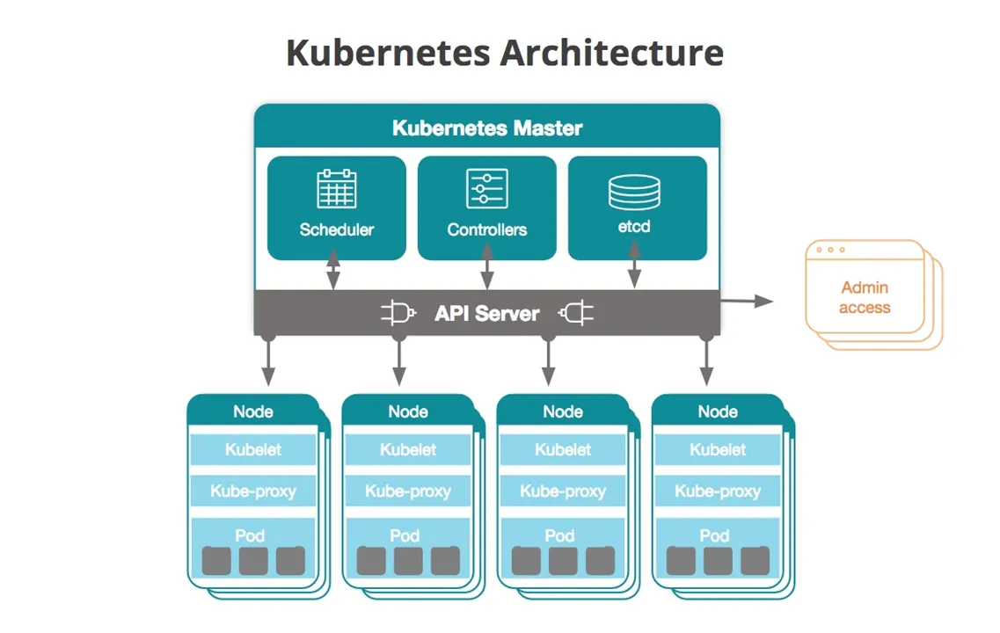
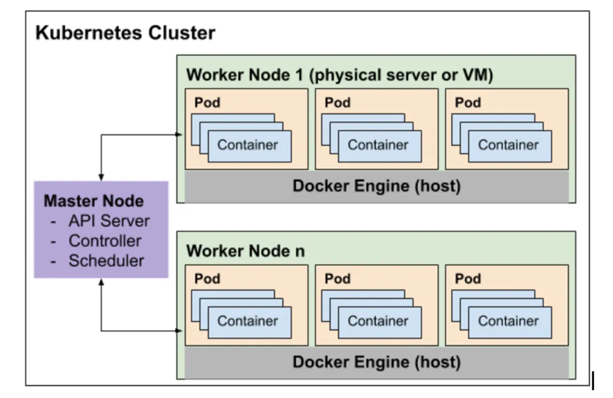
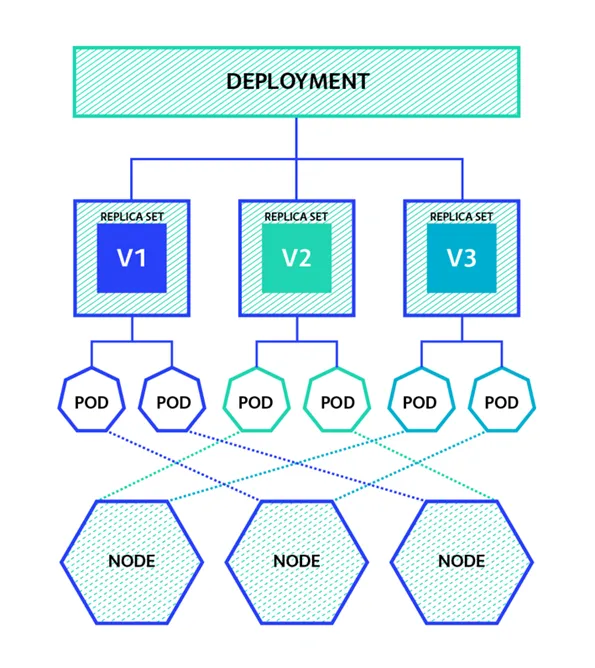

# Kubernetes
---

## Introduction
- "K8s" or "Kube".
- Portable, extensible, open-source container orchestration platform.
- Has a large ecosystem.
- Automates the deployment and scaling of containerized applications with zero downtime and facilitates the management of container-based workloads.
- It provides a platform for running and managing applications in a distributed environment, while abstracting away the underlying infrastructure.
- It handles tasks such as automatic scaling, load balancing, service discovery, rolling updates, and self-healing of containers.

---

## K8s Components
- Configured by defining the Nodes, Pods and Containers within them.
- The central component of Kubernetes is the **<u>Cluster</u>**.
    - A set of **nodes** grouped together.
    - Can be composed by multiple virtual/physical machines.
    - They can include multiple **<u>Nodes</u>**:
        - Each one is its own environment.
        - Can be either a virtual or physical machine.
        - In a managed environment:
            - The cloud provider manages the machine creation/destruction.
        - In a non-managed environment:
            - The machines for each node in a Kubernetes cluster must already exist, so the control plane (master) can know which nodes it can use.
            - They then need to be configured to communicate with the control plane, so they can join the cluster.
        - Each Node hosts a **<u>Pod</u>**.
            - Each pod can host one or multiple Containers, with shared storage and network resources.
            - An abstraction layer over a container. A specification on how to run the containers and creates a running environment over the container.
            - Represents a single instance of an application.
            - They have their own IP addresses and a single DNS name for a set of pods.
    - The **<u>Master</u>** communicates with the Nodes to create or destroy Containers.
        - The Master has **Controllers**
            - They maintain the desired state of the Cluster.
            - Defines which applications or workloads should be running, which resources should be made available to them, and other configuration details.
            - Configured by defining the Nodes, Pods and Containers within them.
    - **<u>Deployment</u>**:
        - Used to define the desired state of a pod or a replica set within a cluster.
        - Instructs how to create and update instances of an application.
        - When you create a pod without specifying any node constraints, the Kubernetes scheduler will automatically assign the pod to an available node in the cluster.
    - <u>Replica set</u>:
        - A higher-level abstraction that manages a set of identical pods.
        - Manages pods, not nodes.
        - To achieve high availability. Ensures that a specified number of replicas of a pod are running distributed across available nodes in the cluster at all times. Automatically replaces dead pods.
        - E.g.: if you have a replica set with three replicas, Kubernetes will attempt to ensure that all three replicas are running on different nodes (to provide fault tolerance) but within the constraints of your cluster's resources.

---

## Port configurations
- **Port** exposes the Kubernetes service on the specified port within the cluster. Other pods within the cluster can communicate with this server on the specified port.
- **TargetPort** is the port on which the service will send requests to, that your pod will be listening on.
- **NodePort** exposes a service externally to the cluster by means of the target nodes IP address and the NodePort. NodePort is the default setting if the port field is not specified.

---

## Declarative vs Imperative
- Imperative:
    - Deploy Kubernetes with the kubectl CLI commands.
- Declarative:
    - Deploy by writing manifest files and deploying by using the `kubectl apply` command.
    - Defined in yaml files.
    - Workflow:
        - `create -f {{menifest-file-name}}.yaml`
            - The manifest file needs to already exist.
            - Creates the manifest file based on the input configuration.
        - `apply -f {{menifest-file-name}}.yaml`
            - Used to apply changes made on the manifest.

---

## Kubectl commands
- Info:
    - `kubectl --help`
    - `kubectl cluster-info`
    - `kubectl get all`
- [`run ...`](https://jamesdefabia.github.io/docs/user-guide/kubectl/kubectl_run)
    - Run a particular image on the cluster.
    - Creates a pod on the cluster.
    - This should not be done directly and instead use deployments.
- [`create deployment ...`](https://kubernetes.io/docs/tutorials/kubernetes-basics/deploy-app/deploy-intro)
    - Used to create the replicasets and the pods (i.e. a deployment).
    - It creates a manifest file based on the input.
- `kubectl logs {id}`
- [`describe ...`](https://jamesdefabia.github.io/docs/user-guide/kubectl/kubectl_describe)
    - `kubectl describe pod {id}`
    - Good for troubleshooting.
- `kubectl delete deployment {name}`

---

## Environments
- Local development
    - During development, images can be saved in the Docker Local Image Repository.
    - The Kubernetes master runs locally.
- Production (managed)
    - Images are saved on a Docker Registry.
        - E.g.: Docker Hub, Azure Container Registry (ACR), Amazon Elastic Container Registry (ECR), etc.
    - The Kubernetes master runs on the cloud, which manages the nodes.
        - E.g.: Azure Kubernetes Service (AKS), AWS Elastic Kubernetes Service (EKS), Google Kubernetes Engine (GKE), etc.

---

## K8s with Terraform
- While Kubernetes focuses on managing containerized applications and the underlying infrastructure, Terraform can be used to provision and manage the infrastructure resources required for running Kubernetes clusters
- TF can be used to provision the underlying virtual machines, networks, storage, and others, as well Kubernetes resources itself, such as creating and configuring Kubernetes API objects like Deployments, Services, ConfigMaps, and Secrets.
- Once the infrastructure is provisioned, Kubernetes can then be deployed on top of it, using tools like kubeadm, Kubernetes the Hard Way, or managed Kubernetes services like AKS, EKS, or GKE.

---
